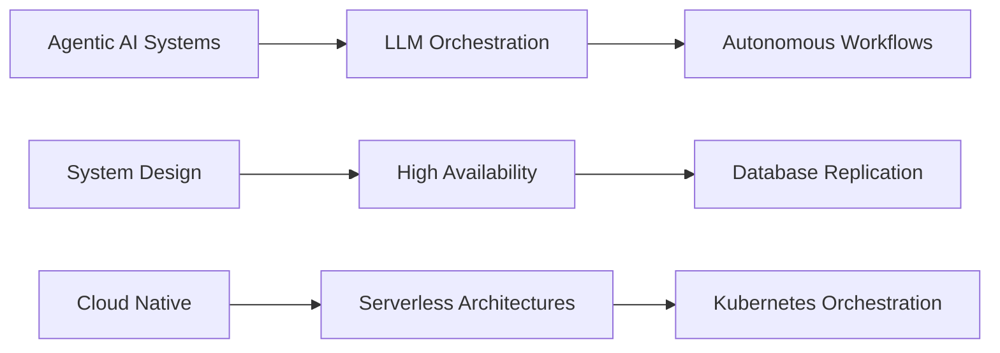

  
<h1>Fouzia Oreen</h1>

### Full-Stack Software Engineer | MERN & Next.js Specialist | AI SaaS Architect

  

  

 

## 📌 Professional Summary

> **5+ years** of experience architecting production-grade SaaS platforms, AI-powered applications, and enterprise-grade web solutions. Specializing in **MERN Stack**, **Next.js**, and **cloud-native architectures** with a passion for creating scalable, maintainable, and pixel-perfect digital experiences.

 
<h3>🎯 Core Expertise</h1>
<table width="100%" border="0" cellpadding="12">
<tr>
<td width="50%" valign="top" style="border: 1px solid #363636; border-radius: 8px; padding: 16px;">

<strong> SaaS & System Architecture</strong>

- Multi-tenant microservice applications 
- Database design & optimization
- Containerization with Docker
- CI/CD pipeline automation

</td>
<td width="50%" valign="top" style="border: 1px solid #363636; border-radius: 8px; padding: 16px;">

<strong> Frontend Engineering</strong>

- React & Next.js (App Router)
- TypeScript & Redux Toolkit
- Performance optimization
- Responsive UI/UX implementation

</td>
</tr>
<tr >
<td width="50%" valign="top" style="border: 1px solid #363636; border-radius: 8px; padding: 16px;">

<strong> Backend Development</strong>

- Node.js, Express, NestJS
- RESTful APIs & GraphQL
- JWT & OAuth authentication
- WebSocket real-time features

</td>
<td width="50%" valign="top" style="border: 1px solid #363636; border-radius: 8px; padding: 16px;">

<strong> Payment & Integration</strong>

- Stripe & SSLCommerz
- PayPal & Braintree
- Webhook management
- Subscription billing systems

</td>
</tr>
</table>

 

## 💼 Professional Journey

###  Full-Stack Software Engineer | Freelance
*2023 – Present*

- Architected **AI-driven SaaS platforms** including a resume builder with OpenAI integration and a multi-store POS system with isolated Docker containers
- Implemented **secure payment infrastructure** using Stripe Connect and SSLCommerz, enabling seamless multi-vendor transactions
- Engineered **analytics dashboards** and course management systems for enterprise LMS platforms
- Optimized Next.js applications achieving **90+ Lighthouse scores** for Core Web Vitals

###  Software Engineer | Ingenious Group
*2021 – 2023*

- Built **reusable component libraries** with React/TypeScript, reducing development time by **30%**
- Improved application performance through **Redux Toolkit optimization**, minimizing unnecessary re-renders
- Collaborated in **agile teams** delivering pixel-perfect interfaces from Figma designs

 

## 🚀 Featured Projects

<table width="100%" border="0" cellpadding="12">
<tr>
<td align="center" width="33%" valign="top" style="border: 1px solid #363636; border-radius: 8px; padding: 20px;">

<h3>Genora Hub</h3>

  
    Resume Builder with <ins>ATS Check, AI Writer, and One-Click Job Tailoring</ins> designed for noob to professionals.
  

`Next.js` • `TypeScript` • `MongoDB`

</td>

<td align="center" width="33%" valign="top" style="border: 1px solid #363636; border-radius: 8px; padding: 20px;">

<h3> Multi-Store POS</h3>

  
    Enterprise <ins>multi-tenant</ins> commerce engine featuring advanced <ins>split payments & inventory syncing</ins>.
  

`MERN` • `Docker` • `Stripe Connect`

</td>

<td align="center" width="33%" valign="top" style="border: 1px solid #363636; border-radius: 8px; padding: 20px;">

<h3> IntelliVoice</h3>

  
    SaaS platform with <ins>voice-activated invoicing, multi-role dashboards, and dark mode UI</ins>.
  

`Nextjs` • `Typescript` • `Node.js` • `Postgres`

</td>
</tr>

<tr>
<td align="center" width="33%" valign="top" style="border: 1px solid #363636; border-radius: 8px; padding: 20px;">

<h3> Hire Mind</h3>

  
    An <ins>AI-Powered Interview Preparation Platform</ins> with subscription management.
  

`Next.js` • `TypeScript` • `Supabase`

</td>

<td align="center" width="33%" valign="top" style="border: 1px solid #363636; border-radius: 8px; padding: 20px;">

<h3> Organic Farm</h3>

  
    Multi-vendor e-commerce with <ins>multi-tenant</ins> architecture featuring <ins>split payments & inventory</ins> management.
  

`MERN` • `Docker` • `Stripe Connect`

</td>

<td align="center" width="33%" valign="top" style="border: 1px solid #363636; border-radius: 8px; padding: 20px;">

<h3> Brain-Gems LMS</h3>

  
    Comprehensive education platform equipped with <ins>multi-role dashboards, analytical pacing, and dark mode UI</ins>.
  

`React` • `Redux` • `Node.js` • `MongoDB`

</td>
</tr>
</table>

 

## 🛠️ Technology Arsenal

### Frontend Stack

  

### Backend & Database

  

### DevOps & Cloud

  

### Design & Tools

  

### 🤖 AI & Language Models

  
  
  

 

## 🌱 Current Focus

 

  
### Open to exciting opportunities, collaborations, and innovative projects.

⭐ If you find my work interesting, feel free to connect or explore my repositories.

